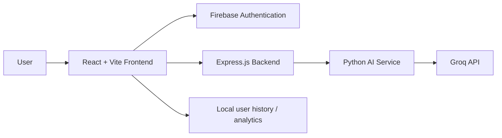

# AI Email Generator

A professional AI-powered web application for generating polished, context-aware emails in seconds. The platform allows users to sign up, log in, create emails based on specific goals, review generated drafts, copy results, and view a personalized history of their generated content.

## Overview

AI Email Generator combines a modern React frontend, Firebase authentication, an Express API layer, and a Python AI engine powered by Groq. The application is designed for speed, clarity, and a clean user experience while keeping the core email-generation flow simple and reliable.

## Key Features

- Secure user authentication with Firebase
- Protected dashboard experience
- AI-generated email subject and body
- Customizable inputs for purpose, recipient, context, tone, formality, length, and language
- Copy-to-clipboard support
- Save and review previous email drafts
- User-specific history analytics view
- Clean, minimal, professional SaaS-style UI

## Architecture



### Architecture Summary

1. Frontend Layer
   - Built with React and Vite
   - Handles authentication, dashboard flow, generator form, and analytics UI

2. Authentication Layer
   - Firebase Email/Password authentication manages secure user sign-in and session state

3. Backend Layer
   - Node.js + Express acts as the API gateway between the frontend and the AI engine
   - Validates request payloads and orchestrates AI generation

4. AI Layer
   - Python service reads structured input, sends it to Groq, validates the output, and returns a JSON response
   - Uses the OpenAI-compatible SDK with a structured response schema

5. Data Layer
   - User identity is managed through Firebase
   - Email history is stored per user to maintain privacy and personalization

## Tech Stack

- Frontend: React, Vite, JavaScript
- Authentication: Firebase Authentication
- Backend: Node.js, Express
- AI Engine: Python, OpenAI SDK, Pydantic
- Model Provider: Groq
- Environment Configuration: .env files

## Project Structure

```text
AI Email Generator/
├── .env
├── .gitignore
├── README.md
├── requirements.txt
├── src/
│   └── main.py
├── backend/
│   ├── package.json
│   └── server.js
├── frontend/
│   ├── .env
│   ├── package.json
│   ├── index.html
│   ├── vite.config.js
│   └── src/
│       ├── App.jsx
│       ├── App.css
│       ├── firebase.js
│       ├── index.css
│       └── main.jsx
└── .venv/
```

## Setup Instructions

### 1. Clone the repository

```bash
git clone <your-repository-url>
cd "AI Email Generator"
```

### 2. Create environment variables

Create a root `.env` file for the Python AI service:

```env
GROQ_API_KEY=your_groq_api_key_here
```

Create a frontend `.env` file for Firebase configuration:

```env
VITE_FIREBASE_API_KEY=your_api_key
VITE_FIREBASE_AUTH_DOMAIN=your_project.firebaseapp.com
VITE_FIREBASE_PROJECT_ID=your_project_id
VITE_FIREBASE_STORAGE_BUCKET=your_project.firebasestorage.app
VITE_FIREBASE_MESSAGING_SENDER_ID=your_sender_id
VITE_FIREBASE_APP_ID=your_app_id
```

### 3. Set up the Python environment

```bash
python -m venv .venv
```

On Windows:

```powershell
.venv\Scripts\Activate.ps1
```

Then install dependencies:

```bash
pip install -r requirements.txt
```

### 4. Install frontend dependencies

```bash
cd frontend
npm install
```

### 5. Install backend dependencies

```bash
cd backend
npm install
```

## Run the Application

### Start the backend

```bash
cd backend
node server.js
```

or:

```bash
npm start
```

### Start the frontend

```bash
cd frontend
npm run dev
```

The frontend usually runs on a Vite local port such as `5173` or `5174`, while the backend runs on `5000`.

## API Endpoint

### Generate Email

- Endpoint: `POST /api/generate-email`
- Request body fields:
  - `purpose`
  - `recipient`
  - `context`
  - `importantPoints`
  - `tone`
  - `formality`
  - `length`
  - `language`

Example payload:

```json
{
  "purpose": "Request a meeting",
  "recipient": "Hiring Manager",
  "context": "Following up on the application review process.",
  "importantPoints": "Ask for time to discuss role fit and next steps.",
  "tone": "Professional",
  "formality": "Formal",
  "length": "Medium",
  "language": "English"
}
```

## Security Notes

- Never commit `.env` files
- Keep API keys in local environment configuration only
- Do not expose backend secrets in frontend code
- Use Firebase Rules and secure storage policies for production deployment

## Production Considerations

This project is a strong foundation for a production-grade SaaS email assistant. Recommended future improvements include:

- Firestore-backed user email history
- Role-based access control
- Secure backend authentication checks
- Rate limiting and abuse prevention
- Analytics dashboards with usage insights
- Deployment to Azure, Vercel, or similar platforms

## License

This project is currently for personal or internal development use. Add a license file if you plan to make it public or share it with a team.

## Contributing

This project is suitable for learning, prototyping, and extending into a production product. If you plan to collaborate, keep feature work organized and document changes clearly.
